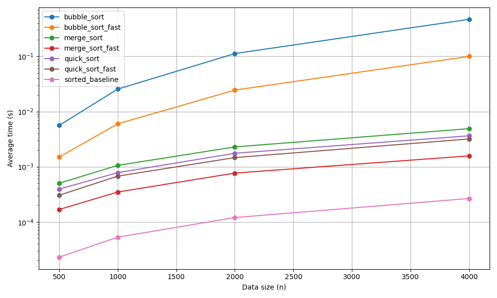

# 排序效能實驗室 — 實驗報告

## 方法

實作 bubble sort、quick sort、merge sort 三種排序演算法，並使用 Cython（`cdef` 型別標註）加速。
以自製 `@timeit` 裝飾器量測各演算法在不同資料量（n=500, 1000, 2000, 4000）下的平均耗時，
每種 n 重複 3 次取平均，種子固定（seed=42）以確保可重現性。

## 數據表

| n    | bubble_sort | quick_sort | merge_sort | bubble_fast | quick_fast | merge_fast | sorted(baseline) |
|------|------------|------------|------------|-------------|------------|------------|------------------|
| 500  | 0.00561    | 0.00039    | 0.00050    | 0.00149     | 0.00030    | 0.00017    | 0.00002          |
| 1000 | 0.02549    | 0.00078    | 0.00106    | 0.00599     | 0.00067    | 0.00035    | 0.00005          |
| 2000 | 0.11239    | 0.00175    | 0.00229    | 0.02447     | 0.00146    | 0.00077    | 0.00012          |
| 4000 | 0.46894    | 0.00363    | 0.00490    | 0.10000     | 0.00319    | 0.00157    | 0.00027          |

## 加速比（4000 筆）

| 演算法   | 純 Python | Cython 版 | 加速比 |
|---------|-----------|-----------|--------|
| bubble  | 0.4689s   | 0.1000s   | 4.7x   |
| quick   | 0.0036s   | 0.0032s   | 1.1x   |
| merge   | 0.0049s   | 0.0016s   | 3.1x   |

## 圖表

## 解讀

1. **最快**：`sorted()`（Timsort，C 實作）是壓倒性最快的，n=4000 只需 0.00027s。
2. **O(n²) vs O(n log n)**：bubble 的線斜率明顯陡峭（log scale 上仍可看出），
   quick / merge / sorted 因時間不在同一個數量級，在線性 scale 下幾乎貼底。
3. **Cython 加速效果**：bubble 受益最大（4.7x），因為其雙層迴圈是純 Python 瓶頸；
   merge 也有 3.1x 改善；quick 因主體是 list comprehension（已在 C 層），僅 1.1x。

## 安全自掃記錄

| OpenSSF 條目 | 問題 | 處理方式 |
|-------------|------|---------|
| 08 Coding Standards | `sorts.py` 未使用的 `import random` | 移除該行 |
| 03 Numbers | `make_data` 未驗證 n 為負數 | 加入 `ValueError` 檢查 |
| 05 Exception Handling | `load_results` 預期 JSON 頂層為 dict 但無檢查 | 加入 `isinstance` 驗證 |
| 04 Neutralization | `results.json` 使用 json 而非 pickle | 適用，已使用安全格式，不需修改 |

### 不適用條目判斷

- `random` 改 `secrets`：benchmark 資料生成非安全敏感，使用 `random` 正確
- `assert` 用於輸入驗證：程式無使用 `assert` 做驗證，不適用
- 邊迭代邊改 list：排序皆複製一份再操作，不適用
- except 全包：無裸 `except:`，不適用
